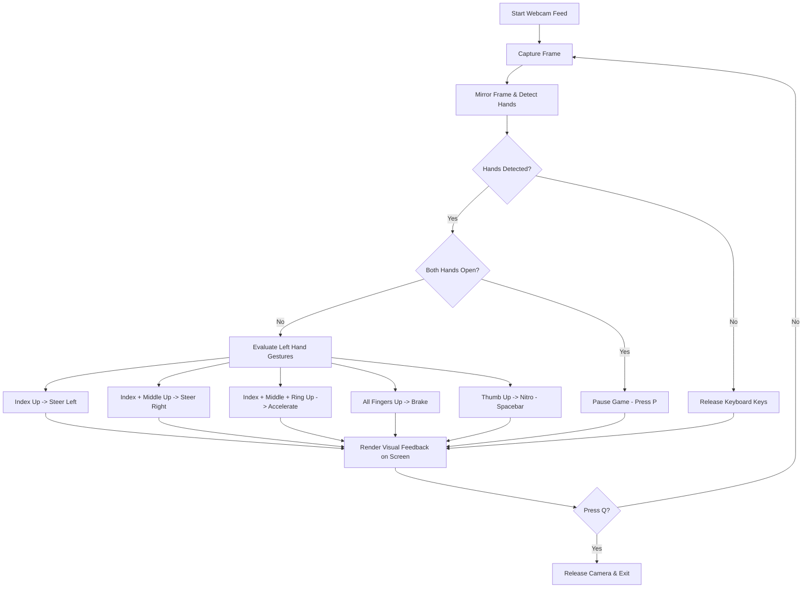

# Asphalt 8 OpenCV Hand Gesture Controller

A real-time hand gesture control interface using Python, OpenCV, Mediapipe, and cvzone to control Asphalt 8 gameplay via webcam feed.

## Features

- **Steer Left/Right**: Simulated arrow key presses using hand gestures.
- **Accelerate & Brake**: Smooth speed control via hand pose recognition.
- **Nitro Boost**: Simulate spacebar using thumb-up gestures.
- **Pause/Resume**: Automatically pause the game when both hands are held open.

---

## Workflow of the Project

The script captures video frames in real-time, flips them to match mirror perspective, detects hands using landmarks, and maps specific gestures to keyboard actions:



---

## Gestures & Controls Mapping

The mapping of hand gestures to PC keyboard simulation:

| Hand State (Left Hand) | Gesture Pattern | Game Action | Key Simulated |
| :--- | :--- | :--- | :--- |
| **Index Finger Up** | `[0, 1, 0, 0, 0]` | Steer Left | `Left Arrow` |
| **Index + Middle Up** | `[0, 1, 1, 0, 0]` | Steer Right | `Right Arrow` |
| **Index + Middle + Ring Up** | `[0, 1, 1, 1, 0]` | Accelerate | `Up Arrow` |
| **All Fingers Up (Open Hand)** | `[1, 1, 1, 1, 1]` | Brake | `Down Arrow` |
| **Thumb Up** | `[1, 0, 0, 0, 0]` | Nitro | `Space` |
| **Both Hands Open** | `[1, 1, 1, 1, 1]` x 2 | Pause Game | `p` |

---

## Requirements

Ensure you have Python 3.8+ installed. You can install the required packages using:

```bash
pip install -r requirements.txt
```

## How to Run

1. Open Asphalt 8 on your PC.
2. Start the gesture controller:
   ```bash
   python asphalt.py
   ```
3. Use the gestures above in front of your webcam to control the vehicle.
4. Press `q` in the camera preview window to quit the controller.
